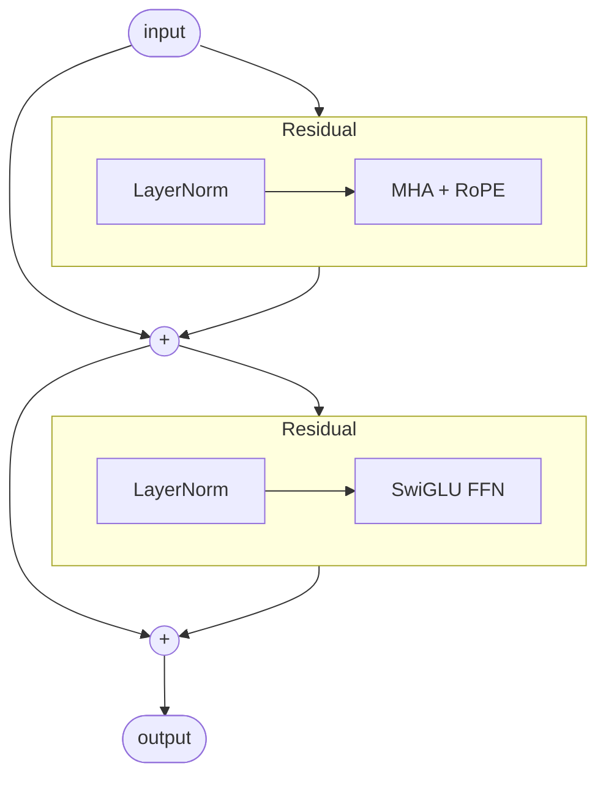

# The Block System

OLM's central design decision is to treat **architecture as composition**. Instead of writing a bespoke `forward()` method for every model, you assemble models from two kinds of pieces:

- **Blocks** — ordered containers that run their children in sequence.
- **Combinators** — wrappers that express non-sequential structure: skip connections, repetition, and branching.

The payoff is that a model definition reads like its architecture diagram, components are swappable in isolation, and novel wiring is expressed directly rather than encoded inside a monolithic forward pass.

> [!NOTE]
> The Block system is a convenience, not a constraint. Every block is a plain `torch.nn.Module`. You can freely mix hand-written modules with blocks, or ignore blocks entirely and write an ordinary `forward()` — OLM supports both, because a "block" is just a module.

## Motivation

Consider what changes when you want to try a research idea — say, replacing post-norm with pre-norm, or swapping multi-head attention for grouped-query attention. In a typical implementation, the layer logic and the wiring (residuals, normalization placement, layer count) live together in one class. Changing the wiring means editing — or forking — that class.

OLM separates the two concerns:

- *What a component does* lives in a module (`MultiHeadAttention`, `SwiGLUFFN`, `RMSNorm`, …).
- *How components are connected* is expressed with blocks and combinators.

Because these are independent, an ablation that would otherwise require a new model file becomes a local edit — often a single line.

## Blocks

A [`Block`](../api/nn.md#block) wraps a list of modules and applies them in order, threading each output into the next input. It is conceptually `nn.Sequential`, but designed to be nested and inspected.

```python
from olm.nn.structure import Block
from olm.nn.norms import LayerNorm
from olm.nn.attention import MultiHeadAttentionwithRoPE
from olm.nn.feedforward import SwiGLUFFN

attention = Block([
    LayerNorm(512),
    MultiHeadAttentionwithRoPE(512, num_heads=8, max_seq_len=1024, causal=True),
])

out = attention(x)   # x: (batch, seq, 512)
```

Blocks nest, so an entire model is a block whose children are themselves blocks:

```python
from olm.nn.embeddings import Embedding
from olm.nn.blocks import OutputHead

model = Block([
    Embedding(vocab_size, 512),
    attention,          # a block can contain other blocks
    OutputHead(512, vocab_size),
])

logits = model(input_ids)
```

The children are stored in `model.blocks` (an `nn.ModuleList`), so a model remains fully inspectable and editable after construction. For example, GPT-2-style weight tying connects the output projection to the input embedding:

```python
# OutputHead is [LayerNorm, Linear]; the Embedding wrapper holds .embedding
model.blocks[2].blocks[1].weight = model.blocks[0].blocks[0].embedding.weight
```

## Combinators

Sequential composition cannot express skip connections, repeated layers, or parallel branches. Combinators handle exactly these structures. All three subclass [`BaseCombinator`](../api/nn.md#basecombinator), and defining your own is a few lines.

### Residual

[`Residual(block)`](../api/nn.md#residual) computes `x + block(x)` — the skip connection that makes deep transformers trainable.

```python
from olm.nn.structure.combinators import Residual

# x + Attn(LayerNorm(x))
attn_residual = Residual(Block([
    LayerNorm(512),
    MultiHeadAttentionwithRoPE(512, 8, 1024, causal=True),
]))
```

### Repeat

[`Repeat(factory, n)`](../api/nn.md#repeat) stacks `n` independent copies of a layer. It takes a *factory* — a zero-argument callable, usually a `lambda` — rather than a module instance, so that each of the `n` layers receives its own freshly initialized weights.

```python
from olm.nn.structure.combinators import Repeat

stack = Repeat(lambda: transformer_block(512, 8, 1024), num_repeat=12)
```

> [!WARNING]
> Pass a factory, not an instance. `Repeat(block, 12)` would place the **same** module — and therefore the same shared weights — at all 12 positions. Always pass a callable: `Repeat(lambda: make_block(), 12)`.

### Parallel

[`Parallel(blocks, merge, dim)`](../api/nn.md#parallel) sends the same input through several branches and combines their outputs. The default merge sums the branches; supply your own callable to concatenate, average, or apply any other reduction.

```python
import torch
from olm.nn.structure.combinators import Parallel

mixture = Parallel(
    [branch_a, branch_b],
    merge=lambda outputs, dim: torch.cat(outputs, dim=dim),
    dim=-1,
)
```

## Worked example: a transformer block

The canonical pre-norm transformer block is two residual sub-blocks — attention, then feed-forward. This is what [`TransformerBlock`](../api/nn.md#transformerblock) constructs.



```python
from olm.nn.structure import Block
from olm.nn.structure.combinators import Residual
from olm.nn.attention import MultiHeadAttentionwithRoPE
from olm.nn.feedforward import SwiGLUFFN
from olm.nn.norms import LayerNorm

def transformer_block(d_model=512, n_heads=8, max_seq_len=1024):
    return Block([
        Residual(Block([
            LayerNorm(d_model),
            MultiHeadAttentionwithRoPE(d_model, n_heads, max_seq_len, causal=True),
        ])),
        Residual(Block([
            LayerNorm(d_model),
            SwiGLUFFN(d_model),
        ])),
    ])
```

## Worked example: a full model with all three combinators

This complete language model uses every combinator: a `Repeat` of `Residual` transformer blocks, plus a `Parallel` "wide MLP" branch summed alongside the transformer stack.

```python
import torch
from olm.nn.structure import Block
from olm.nn.structure.combinators import Residual, Repeat, Parallel
from olm.nn.embeddings import Embedding
from olm.nn.norms import LayerNorm
from olm.nn.feedforward import SwiGLUFFN
from olm.nn.blocks import OutputHead

d_model, vocab = 512, 50257

trunk = Repeat(lambda: transformer_block(d_model), num_repeat=32)
wide_mlp = Block([LayerNorm(d_model), SwiGLUFFN(d_model)])

model = Block([
    Embedding(vocab, d_model),
    Parallel([wide_mlp, trunk], merge=lambda outs, dim: torch.stack(outs).sum(0)),
    OutputHead(d_model, vocab),
])

logits = model(input_ids)   # (batch, seq, vocab)
```

A non-standard architecture — a parallel wide-MLP path beside a 32-layer transformer — is expressed in a handful of readable lines, with no custom `forward()` and no edits to any underlying layer.

## Defining a custom combinator

When the built-ins do not cover a pattern, subclass [`BaseCombinator`](../api/nn.md#basecombinator) and implement `forward`. For example, a gated residual with a learned scalar gate:

```python
import torch
import torch.nn as nn
from olm.nn.structure.combinators import BaseCombinator

class GatedResidual(BaseCombinator):
    """x + sigmoid(g) * block(x), where g is a learned scalar gate."""
    def __init__(self, block: nn.Module):
        super().__init__()
        self.block = block
        self.gate = nn.Parameter(torch.zeros(1))

    def forward(self, x):
        return x + torch.sigmoid(self.gate) * self.block(x)
```

It composes exactly like the built-in combinators — drop it into any `Block` where a module is expected. Custom structures are first-class, not special cases.

## Dropping in custom PyTorch modules

The same is true for ordinary PyTorch modules. If you want to test a custom
attention layer, write it as an `nn.Module` and place it inside a `Block`:

```python
import torch
import torch.nn as nn

from olm.nn.structure import Block
from olm.nn.structure.combinators import Residual
from olm.nn.norms import RMSNorm
from olm.nn.feedforward import SwiGLUFFN

class IdentityAttention(nn.Module):
    """A toy attention replacement for ablation plumbing tests."""
    def __init__(self, d_model):
        super().__init__()
        self.proj = nn.Linear(d_model, d_model)

    def forward(self, x):
        return self.proj(x)

layer = Block([
    Residual(Block([RMSNorm(512), IdentityAttention(512)])),
    Residual(Block([RMSNorm(512), SwiGLUFFN(512)])),
])
```

In a real experiment, `IdentityAttention` might be a sliding-window attention,
linear attention, a retrieval-augmented module, or a debugging shim that records
intermediate tensors. The rest of the model and training loop do not need to know.

## When to reach for raw PyTorch

The Block system is most useful when an architecture is naturally a tree of reusable parts. For control flow that does not fit that shape — for example, an early-exit branch conditioned on a runtime value, or a structure with shared state threaded through several layers — a hand-written `forward()` is clearer. Both styles interoperate: a custom module drops into a `Block`, and a `Block` drops into a custom module.

## Next steps

- [Building Blocks](components.md) — the components you compose: attention, embeddings, normalization, and feed-forward variants.
- [Tutorial: Custom Architectures](../tutorials/custom-architecture.md) — design and train a model from blocks, end to end.
- [`olm.models`](../api/models.md) — reference architectures (GPT-2, Llama, Qwen, …) implemented with exactly these patterns.
