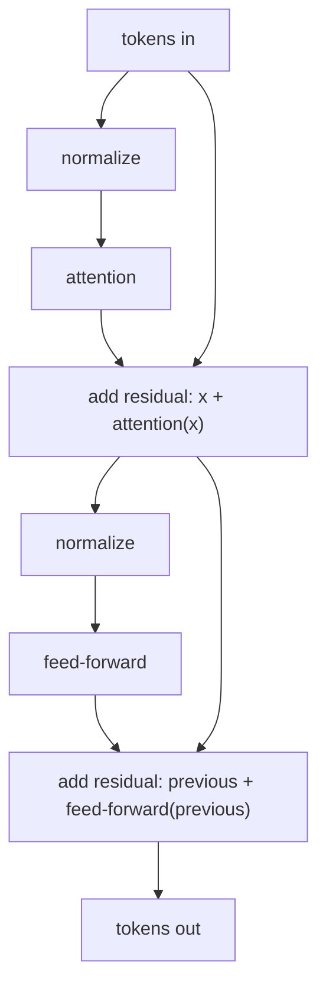
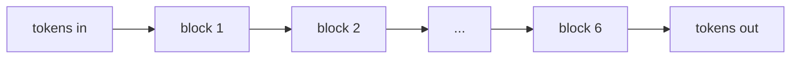

# Lesson 4 · A Whole Transformer Block

You have the two big pieces now: embeddings give each token a meaning (Lesson 2),
and attention lets tokens share context (Lesson 3). Add two small supporting pieces,
wire them together, and you've built the unit that every large language model stacks
over and over — the **transformer block**. We'll build it up one piece at a time.

> Keep your Colab notebook open.

## A tensor to practise on

Before building anything, let's make a small batch of token-vectors to feed through
our parts. One sequence, 6 tokens, each a vector of 16 numbers — just like the
embeddings from Lesson 2, but filled with random numbers so we can experiment:

```python
import torch

embed_dim = 16
x = torch.randn(1, 6, embed_dim)
print(x.shape)   # torch.Size([1, 6, 16])  →  1 sequence, 6 tokens, 16 numbers each
```

We'll push this `x` through each part we build and watch what happens to its shape.

## The four parts of a block

A transformer block is made from four kinds of part. Here's the job of each:

- **Attention** — each token gathers context from the other tokens (Lesson 3).
- **Feed-forward** — each token is then passed through its own little two-layer
  neural network. Attention mixes information *between* tokens; the feed-forward
  works on *each token on its own*.
- **Normalization** — gently rescales the numbers to keep them in a healthy range,
  which keeps training steady.
- **Residual connection** — after a part runs, its input is added back onto its
  output. This keeps the original signal intact and helps deep stacks train.

OLM hands you each of these as a ready-made piece. Now let's meet the two small tools
that wire pieces together.

One name you'll see in the code is **RMSNorm**. It is a normalization layer — the
"keep the numbers at a healthy scale" part above. Recent LLMs like Llama and Qwen
often use RMSNorm; older GPT-style models often use LayerNorm. They play the same
role in the block.

## Tool 1 — `Block`: run parts in order

`Block` takes a list of parts and runs them one after another — the output of one
becomes the input of the next. Let's make a `Block` with a normalization followed by
a feed-forward:

```python
from olm.nn.structure import Block
from olm.nn.norms import RMSNorm
from olm.nn.feedforward import ClassicFFN

small = Block([
    RMSNorm(embed_dim),     # first: rescale the numbers
    ClassicFFN(embed_dim),  # then: the per-token network
])

print(small(x).shape)   # torch.Size([1, 6, 16])
```

`RMSNorm(embed_dim)` is a normalization part and `ClassicFFN(embed_dim)` is a
feed-forward part. `Block` just feeds `x` through the first, then the second. The
shape that comes out is the same as went in — the block changed the *contents* of the
vectors, not their size.

## Tool 2 — `Residual`: add the input back

Recall the residual connection — "add the input back onto the output." `Residual`
does exactly that: you wrap a part in it, and it computes `the part's output + its
input`.

In symbols, instead of replacing `x` with `small(x)`, a residual connection returns
`x + small(x)`. The part can add useful changes, while the original signal still
has a direct path forward.

```python
from olm.nn.structure.combinators import Residual

wrapped = Residual(small)

print(wrapped(x).shape)   # torch.Size([1, 6, 16])
```

Still the same shape — adding two `(1, 6, 16)` tensors gives a `(1, 6, 16)` tensor.
The shape isn't the point; the point is that the original `x` now passes straight
through, with the block's work *added on top* rather than replacing it.

## Putting it together: one block

A transformer block is simply **two** of these residual halves, one after the other:

1. normalize → **attention** → add the input back,
2. normalize → **feed-forward** → add the input back.

Here it is, built entirely from the parts you've now met:

```python
from olm.nn.attention import MultiHeadAttention

block = Block([
    Residual(Block([                                    # half 1: attention
        RMSNorm(embed_dim),
        MultiHeadAttention(embed_dim, num_heads=4, causal=True),
    ])),
    Residual(Block([                                    # half 2: feed-forward
        RMSNorm(embed_dim),
        ClassicFFN(embed_dim),
    ])),
])

print(block(x).shape)   # torch.Size([1, 6, 16])
```

Two small things on the attention line:

- `num_heads=4` runs attention as 4 parallel heads (Lesson 3) — here it splits the
  16 numbers into 4 groups of 4.
- `causal=True` lets each token look only at earlier tokens, which is what you want
  when the job is predicting the next one.

This is the same GPT-style block shape written as a figure, with the residual adds
labelled explicitly:



A block takes a `(1, 6, 16)` sequence and returns a `(1, 6, 16)` sequence — same
shape, richer content. That's the crucial property: because the shape is unchanged,
one block's output can feed straight into another block.

## Stacking blocks

A transformer is just many blocks in a row. OLM's `Repeat` builds the stack for you.
You give it a small function that makes a fresh block, and how many you want:

```python
from olm.nn.structure.combinators import Repeat

transformer_block = lambda: Block([
    Residual(Block([RMSNorm(embed_dim), MultiHeadAttention(embed_dim, num_heads=4, causal=True)])),
    Residual(Block([RMSNorm(embed_dim), ClassicFFN(embed_dim)])),
])

stack = Repeat(transformer_block, 6)   # six blocks in a row

print(stack(x).shape)   # torch.Size([1, 6, 16])
```

The `lambda:` is a compact way to write a tiny unnamed function — here, a function
that builds a **brand-new** block. That detail matters: `Repeat` calls the function
6 times, so each layer gets its own weights. If you reused the same block object six
times, all six positions would accidentally share weights. Same shape the whole way
through. Real models stack anywhere from a dozen blocks to over a hundred — that
depth is a big part of what "a bigger model" means.



> [!NOTE]
> Real architectures add one more ingredient — a sense of word order, called
> *positional information* — which OLM's RoPE attention variants handle. You can see
> all the components side by side in [Building Blocks](../guides/components.md).

Put a token embedding (Lesson 2) in front of this stack and an output head behind
it, and you have a complete language model. The output head turns each final token
vector into one score for every token in the vocabulary — the scores used to predict
the next token. In OLM's ready-made `LM`, the output head is tied to the token
embedding by default, so the same learned token table helps read tokens in and score
tokens out.

## What you learned

- A transformer block has four parts: **attention** (share context), **feed-forward**
  (process each token), **normalization** (steady numbers), and a **residual**
  connection (add the input back).
- `Block` runs parts in order; `Residual` adds a part's input back onto its output;
  `Repeat` stacks many blocks.
- Every part keeps the shape `(1, 6, 16)` → `(1, 6, 16)`, which is exactly why blocks
  can stack endlessly.
- A token embedding in front and an output head behind turn a stack of blocks into a
  language model.

You've built the core of a transformer. The one thing left is what makes it any
*good*: training. That's next.

**Next:** [Lesson 5 · How a Model Learns](how-a-model-learns.md)
