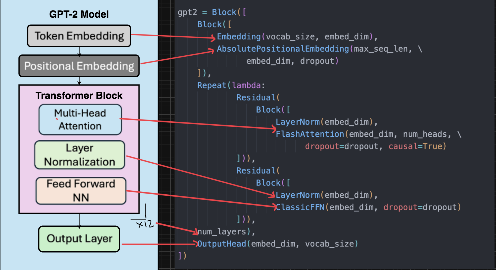

# Lesson 5 · How a Model Learns

In Lesson 4 you built one transformer block and stacked it. Put a token embedding in
front and an output head behind, and that stack becomes a *complete* language model.
Let's assemble a real one — the GPT-2 architecture — from OLM parts, and then teach it
to write.

> Keep your Colab notebook open.

## A whole GPT-2, from scratch

GPT-2 is nothing more than the pieces you already know, arranged in a set order: a
token embedding, a positional embedding (so the model knows word order), a stack of
transformer blocks, and an output head. Here's the architecture next to the OLM code
that builds each part:



And here it is in code — read it against the picture, piece by piece:

```python
from olm.data.tokenization import HFTokenizer
from olm.nn.structure import Block
from olm.nn.structure.combinators import Residual, Repeat
from olm.nn.embeddings import Embedding, AbsolutePositionalEmbedding
from olm.nn.attention import MultiHeadAttention
from olm.nn.feedforward import ClassicFFN
from olm.nn.norms import LayerNorm
from olm.nn.blocks import OutputHead

tok = HFTokenizer("gpt2")

embed_dim   = 768     # numbers per token
num_heads   = 12      # attention heads in each block
num_layers  = 12      # transformer blocks in the stack
max_seq_len = 1024    # longest sequence it can read

gpt2 = Block([
    Embedding(tok.vocab_size, embed_dim),                 # tokens → vectors        (Lesson 2)
    AbsolutePositionalEmbedding(max_seq_len, embed_dim),  # add word-order info
    Repeat(lambda: Block([                                # the stack of blocks     (Lesson 4)
        Residual(Block([LayerNorm(embed_dim), MultiHeadAttention(embed_dim, num_heads, causal=True)])),
        Residual(Block([LayerNorm(embed_dim), ClassicFFN(embed_dim)])),
    ]), num_layers),
    OutputHead(embed_dim, tok.vocab_size),                # vectors → a score per token
])

n_params = sum(p.numel() for p in gpt2.parameters())
print(f"{n_params/1e6:.0f}M parameters")
```

That's it — that's GPT-2, built from the same handful of parts you met over the last
three lessons. The print shows it holds well over a hundred million numbers.

> [!NOTE]
> This is exactly what OLM's ready-made `LM` (and the `GPT2` preset) wrap up for you —
> assembling it by hand just shows there's no magic inside. To actually *train* one on
> a laptop you'd use a much smaller version, which is what the next tutorial does.

> [!TIP]
> Notice the small swap from Lesson 4: there we used **RMSNorm**, because it is the
> modern default in Llama/Qwen-style models. GPT-2 is older and uses **LayerNorm**.
> Both are normalization layers; the architecture changes, but the role is the same.

## Right now, it knows nothing

Every one of those hundred-million-plus numbers — the model's **weights** — started at
a random value. Feed "The cat sat on the" into this fresh model and its guess for the
next token is essentially a coin toss across the whole vocabulary. Training is how
those random numbers turn into ones that predict real language — through practice.

## The loop: guess, score, nudge, repeat

Training is a loop. One round of it goes like this:

1. **Guess.** Take a chunk of real text and feed it in. At every position, the model
   predicts the next token.
2. **Score.** Compare each prediction to the token that *actually* came next, and boil
   the result down to a single number — the **loss** — that says how wrong the model
   was. A big loss means very wrong.
3. **Nudge.** Adjust every weight a tiny amount, in the direction that would have made
   the loss a little smaller.
4. **Repeat.** Do it again with the next chunk of text. Millions of times, over
   mountains of text.

Slowly, the random numbers settle into values that predict real language well. That's
all training is — the same four steps, over and over.

The clever part is step 3. You never work out those adjustments yourself: an algorithm
called **backpropagation** figures out, for every weight, which way to nudge it, and an
**optimizer** applies the nudges. You can train models your whole life without ever
doing that calculation by hand.

## Reading the numbers while it trains

As a model trains, you mostly watch two numbers:

- **Loss** — the "how wrong" number from step 2. It starts high and should drift
  **down** as training goes on. A falling loss is the sign it's working.
- **Perplexity** — a friendlier way to read the loss: roughly, "how many tokens was the
  model torn between?" A perplexity of 20 means it was about as unsure as picking among
  20 equally likely words. Perplexity of 1 would be perfect. Lower is better.

Two more words you'll see:

- **Learning rate** — how big each nudge is. Too big and training is unstable; too small
  and it crawls.
- **Epoch / step** — an *epoch* is one full pass over your data; a *step* is one nudge
  (one round of the loop).

## What the loop looks like in code

Because OLM models are ordinary PyTorch, the heart of training is only a handful of
lines. You won't run this snippet — it's here just to show how little there is to it:

```python
for inputs, targets in data:              # a chunk of text, and what comes next
    predictions = model(inputs)           # 1. guess
    loss = loss_fn(predictions, targets)  # 2. score
    loss.backward()                       # 3. work out the nudges
    optimizer.step()                      #    apply them
    optimizer.zero_grad()                 #    reset for the next round
```

That's the whole idea: guess, score, nudge, reset, repeat.

## Letting OLM run the loop

In practice you don't write that loop by hand — OLM's `Trainer` runs it for you and
handles the practical details (batching, the learning-rate schedule, reporting). You
hand it a model, an optimizer, and your data, and call `train`:

```python
from olm.train import Trainer

trainer = Trainer(model, optimizer, loader, device, context_length=128)
losses = trainer.train(epochs=1, max_steps=100)
```

Each step, it does exactly the four things above and prints the loss falling as the
model learns.

## You've finished the foundations

Stop and look at what you can now explain: text becomes tokens and then embeddings;
attention lets words share context; blocks stack into a transformer; an embedding and
output layer make it a full model; and training nudges its random weights into one that
predicts real language. That's the whole shape of how a language model works.

Now it's time for the payoff: do it for real, end to end, on actual text. The next
tutorial uses a much smaller GPT-style model so you can train it, watch the loss
fall, and generate text in the same session:

**Next:** [Your First Language Model](../tutorials/first-model.md)

> Want to know *exactly* how attention computes which words matter — queries, keys, and
> all? That's the one piece we treated as a black box. It's written up in
> [How Attention Works (deep dive)](attention-in-detail.md) — entirely optional, and a
> good read once the rest has settled.
