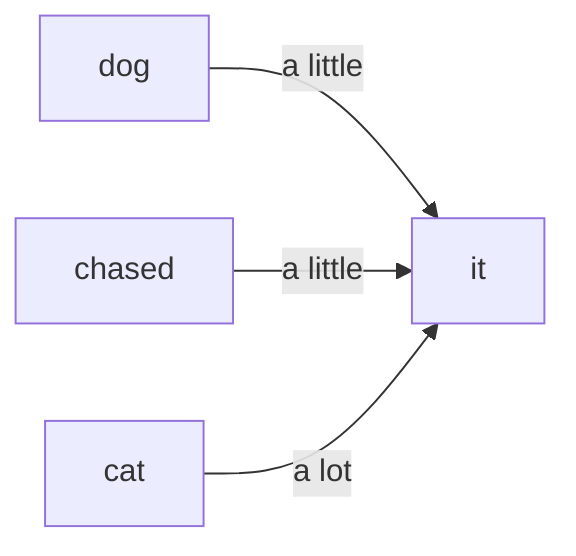

# Lesson 3 · Paying Attention

In Lesson 2 every token became a meaning-vector — but on its own, with no sense of
the sentence it sits in. That's a problem, because a word's real meaning depends on
the words around it. This short lesson is about the idea that fixes that: **attention**.

> This is a "big idea" lesson — no code. It gives you everything you need to
> understand the transformer block you'll build in Lesson 4.

## A word's meaning depends on its neighbours

Look at the word "bank" in two sentences:

- "We sat on the **bank** and watched the river."
- "She opened a **bank** account."

Same token, completely different meaning — and the only thing that decided it was
the surrounding words. Or take a pronoun:

- "The dog chased the cat until **it** climbed a tree."

Who is "it"? Obviously the cat — but you only know that from the rest of the
sentence. A single, fixed vector for "bank" or "it" can't capture this. Each word
needs a way to **update itself using the other words around it**.

## What attention does

Attention is exactly that step. For every word, it looks at the other words,
decides which ones are relevant, and blends their information in. After attention:

- "bank" sitting near "river" has shifted toward the *riverside* meaning,
- "it" has pulled in "cat" and now stands for it.

It does this for every word at the same time. A simple way to picture it: when the
model works out what "it" refers to, it leans heavily on "cat" and barely on the
other words.

Two more things worth knowing, both just one idea each:

- **Looking back only.** When the model's job is to predict the *next* word, each
  word is allowed to look at the words *before* it, never after — it can't peek at
  the future it's trying to guess.
- **Several at once.** The model actually runs attention several times in parallel.
  Each run (a "head") can specialise — one might follow grammar, another the
  subject, another the topic — and their findings are combined.

## That's the idea

You now know what attention is *for*: letting words gather context from other
words, so each token's meaning fits the sentence it's in. That's all you need to
understand the transformer block in the next lesson, where attention becomes a
single labelled part you plug in.

If you want to see *exactly* how attention works out which words matter, there's a
detailed walkthrough later in the course:
[How Attention Works (deep dive)](attention-in-detail.md). For another excellent visual
explanation, see [The Illustrated Transformer](https://jalammar.github.io/illustrated-transformer/).
You don't need either to keep going — the idea above is enough.

## What you learned

- A word's meaning depends on the words around it; a lone embedding can't capture
  that.
- **Attention** lets every word look at the others, pick out what's relevant, and
  absorb it — so meaning becomes context-aware.
- When predicting the next word, attention looks **only backward**, and runs as
  several parallel **heads** that each track different relationships.

You've now met two of a transformer's parts — embeddings and attention. Next we add
the last couple and wire them into the unit every language model is built from.

**Next:** [Lesson 4 · A Whole Transformer Block](a-transformer-block.md)
