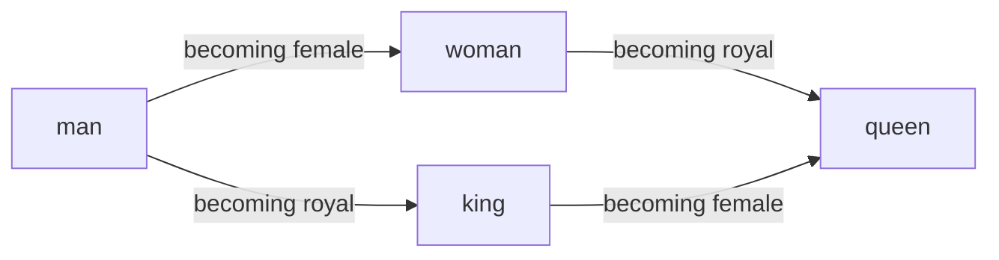

# Lesson 2 · Words as Vectors

In Lesson 1 you turned text into token IDs — plain row numbers. But a row number
carries no *meaning*: nothing about the number `3797` tells you it stands for
"cat". In this lesson you'll meet the idea that fixes that, and see one of the
most surprising results in all of machine learning.

> Keep your Colab notebook from Lesson 1 open. We'll build on it.

## The problem with ID numbers

Token IDs are just labels. The tokenizer might give "cat" the ID `3797` and
"dog" the ID `9703`. Those numbers are arbitrary — "cat" isn't *smaller* than
"dog", and the gap between them means nothing. Yet we know cat and dog are
related (both pets, both animals), while cat and "democracy" are not.

Those IDs are assigned by the tokenizer when it builds or loads its vocabulary.
They are like row numbers in a spreadsheet: useful for lookup, but not meaningful
by themselves. ID `3797` simply means "go to row 3797."

So how do we give the model a sense of what words *mean*, and how they relate to
each other? We give each token a **list of numbers** instead of a single one.

## The idea: meaning becomes a place

A list of numbers is called a **vector**. Think of each number as a coordinate.
Two numbers place a word on a flat map (like a point's left-right and up-down
position); add more numbers and you place it in a bigger space. Modern models use
hundreds of numbers per word — a space too big to picture, but easy for a computer.

Here's the goal. We want to arrange words in that space so that **words used in
similar ways sit close together**, and — remarkably — so that the *directions*
between words mean something too:



Read the picture as a map of meaning. "cat", "dog", and "kitten" would huddle in
one corner; "democracy" sits far away in another. And notice the shape above: the
step that turns **man → woman** is the *same* step that turns **king → queen** —
"becoming female" is a consistent direction in the space. Likewise "becoming royal"
is another consistent direction. The model isn't told any of this; the arrangement
is something it *discovers*.

This is why vector arithmetic can work at all. If `aunt - uncle` captures a
"female instead of male" direction, then `king + aunt - uncle` should land very
close to `queen`. Meaning is not stored as a dictionary definition; it is formed
by where each token's fixed-size vector sits, and by the directions between those
vectors.

This list-of-numbers-per-token is called an **embedding**, and it's where the
model stores everything it learns about what each token means.

## How OLM does it: the embedding layer

In OLM, an embedding is a layer you can create directly. It's really just a lookup
table: hand it a token ID, get back that token's vector. Let's make one and watch
the shapes, because understanding the shapes is most of understanding the code.

```python
import torch
from olm.nn.embeddings import Embedding
from olm.data.tokenization import HFTokenizer

tok = HFTokenizer("gpt2")

# Give every token in the vocabulary its own vector of 16 numbers.
emb = Embedding(tok.vocab_size, 16)

ids = tok.encode("the cat sat on the mat")
print(ids.shape)
```

That last line prints something like `torch.Size([6])` — a flat list of 6 token
IDs, one per word here. So far, so good.

Now the embedding layer uses each ID as a row lookup. If a token has ID `3797`,
the layer reads row 3797 of its table. Every row has the same width: here, **16
numbers**. So every token, no matter what its ID is, becomes a vector of the same
size.

Now there's one PyTorch habit to know. Model layers don't process a single
sequence at a time — they process a **batch**: several sequences stacked together
and run at once, because that's far more efficient. So the embedding layer expects
its input shaped as *(number of sequences, number of tokens)* — even when you only
have one sequence.

Our `ids` is just *(6,)* — six tokens, no "how many sequences" slot. We add that
slot with `unsqueeze(0)`, which inserts a new dimension of size 1 at the front:

```python
batched = ids.unsqueeze(0)
print(batched.shape)        # torch.Size([1, 6])  → "1 sequence, 6 tokens"
```

It doesn't change any of the numbers — it just wraps our one sequence so it looks
like "a batch containing a single sequence." Now feed it through the embedding:

```python
vectors = emb(batched)
print(vectors.shape)        # torch.Size([1, 6, 16])
```

Walk through that final shape left to right: **1** sequence, **6** tokens, and now
each token is **16** numbers instead of one. Every token has become a vector —
exactly the representation we wanted.

> [!NOTE]
> Those 16 numbers are **random** right now — you just created the layer, so it
> hasn't learned anything yet. The meaningful arrangement (cat near dog, the tidy
> directions from the picture above) is what the model builds **while you train
> it**, which you'll do later in this course. The embedding layer is simply the
> place that knowledge will live.

That's the honest catch: a brand-new embedding is meaningless, and it only becomes
the beautiful map we drew after training. So how do we know it really works out
that way? Let's look at a set that has *already* been trained.

## See it for real

The clearest way to believe that meaning becomes geometry is to explore real,
trained word vectors yourself. The quickest, no-code option: open the
**[TensorFlow Embedding Projector](https://projector.tensorflow.org)**, type a word
like "king" into the search box, and watch its nearest neighbours light up — words
the model learned were related, purely from reading text.

If you'd like to *run* it and even do the famous word arithmetic, expand the demo
below. It steps outside OLM and borrows a small set of pre-trained vectors — the
same kind of thing OLM's embedding layer learns — just so you can see the idea in
action before you've trained your own.

<details>
<summary>Optional demo: explore trained word vectors in Colab</summary>

This downloads a small set of word vectors (about 66 MB the first time) that were
trained on billions of words:

```python
!pip install gensim
import gensim.downloader as api

wv = api.load("glove-wiki-gigaword-50")   # each word → 50 trained numbers
```

Ask which words sit closest to "king":

```python
wv.most_similar("king")
```

You'll get a list with words like *queen*, *prince*, *kings*, and *monarch*.
Nobody labelled these as related — the structure emerged from learning to use
them in text. Try your own: `wv.most_similar("python")`,
`wv.most_similar("music")`.

Now the surprising part — arithmetic on words. Take "king", subtract "man", add
"woman":

```python
wv.most_similar(positive=["king", "woman"], negative=["man"])
```

Conceptually, that line asks for:

```text
vector("king") - vector("man") + vector("woman") ≈ vector("queen")
```

The top answer is **queen**. You remove the "man" direction from "king", add the
"woman" direction, and land near "queen" — exactly the shape we drew earlier. One
more to try:

```python
wv.most_similar(positive=["paris", "italy"], negative=["france"])   # → rome
```

</details>

<details>
<summary>Going deeper (optional): what's under the hood?</summary>

The embedding layer is a big table (a matrix) with one row per vocabulary token and
one column per embedding dimension; "looking up" a token just selects its row.
During training those rows get nudged along with the rest of the model, and the
nudges that help it predict text well happen to pull similarly-used words together.
"Closeness" is usually measured by **cosine similarity** — how aligned two vectors'
directions are. You never need this to *use* embeddings. See
[Key Concepts → Embeddings](../concepts.md#embeddings) and, for OLM's variants,
[Building Blocks](../guides/components.md).

</details>

## What you learned

- A single ID number can't express meaning, so every token is given a **vector**
  (a list of numbers) called an **embedding**.
- Embeddings place words in a space where **similar words sit close together** and
  **relationships become consistent directions** (man→woman is the same step as
  king→queen).
- OLM's `Embedding` layer stores these vectors. You saw the shapes go from
  *(6,)* → *(1, 6)* → *(1, 6, 16)*: a batch of one sequence, six tokens, each now a
  16-number vector.
- The vectors start **random** and become meaningful only **as the model trains** —
  which is exactly what you'll do later.

Embeddings give the model a meaningful starting point for each token. But to predict
the next word well, it also has to look at the **other** words around it and decide
which ones matter. That looking-around is **attention** — next.

**Next:** [Lesson 3 · Paying Attention](paying-attention.md)
